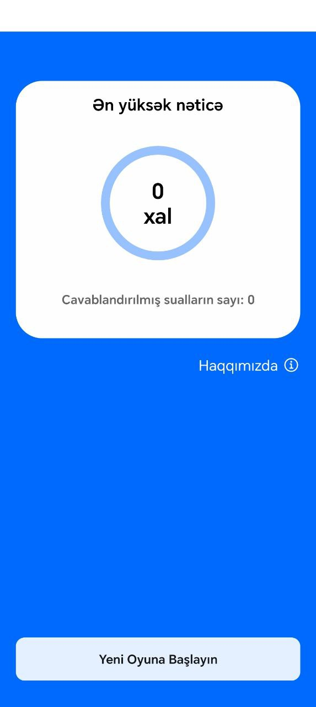
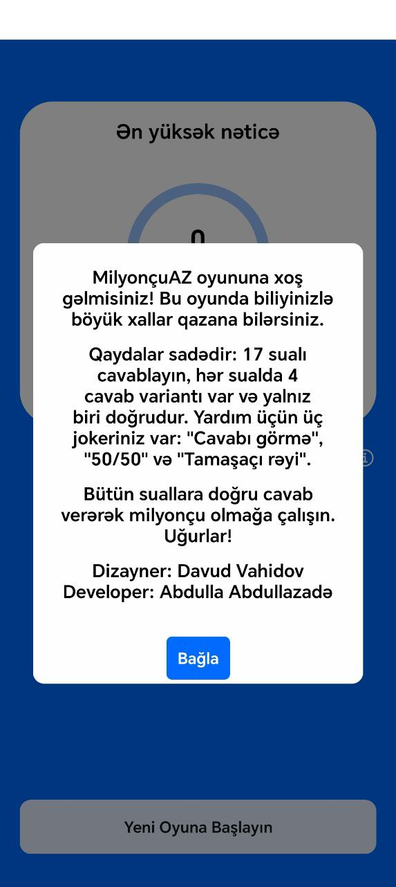
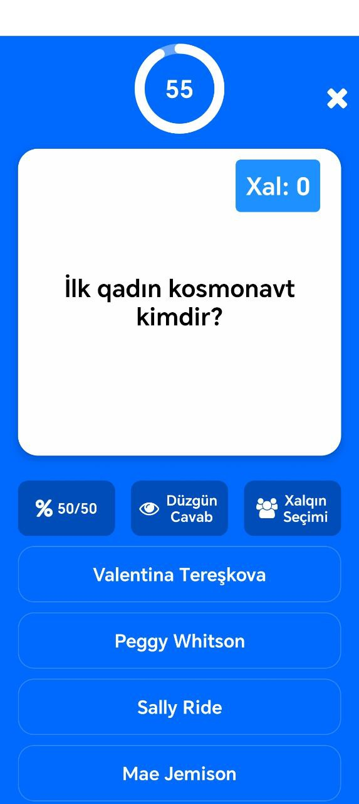
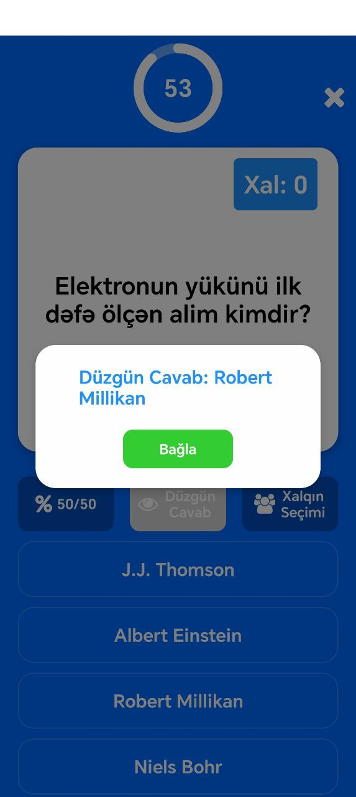
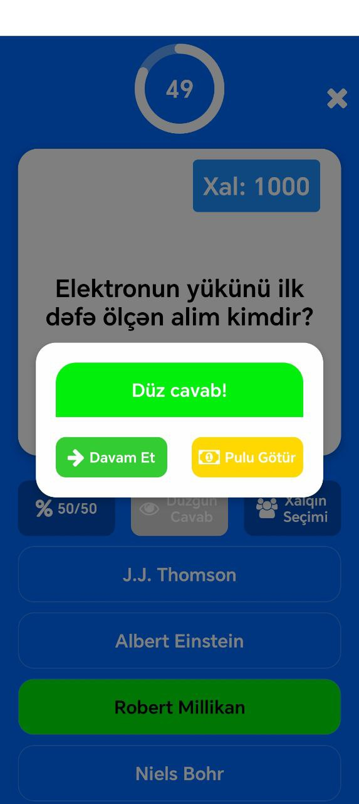
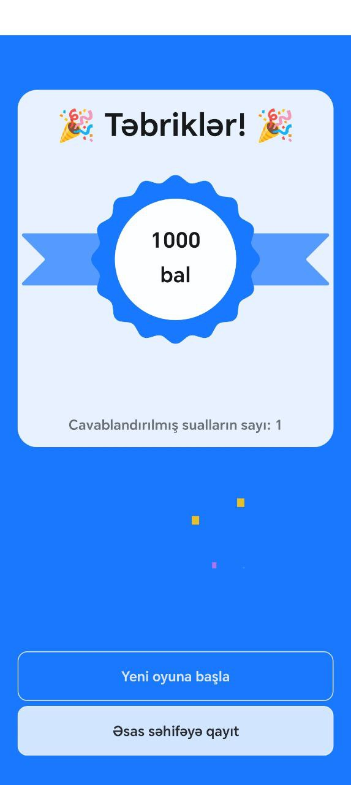
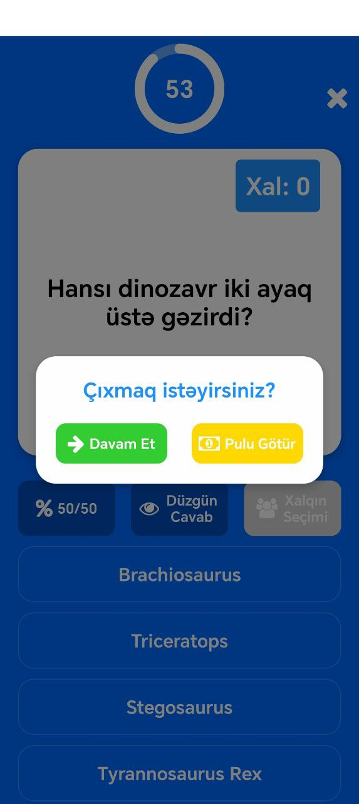
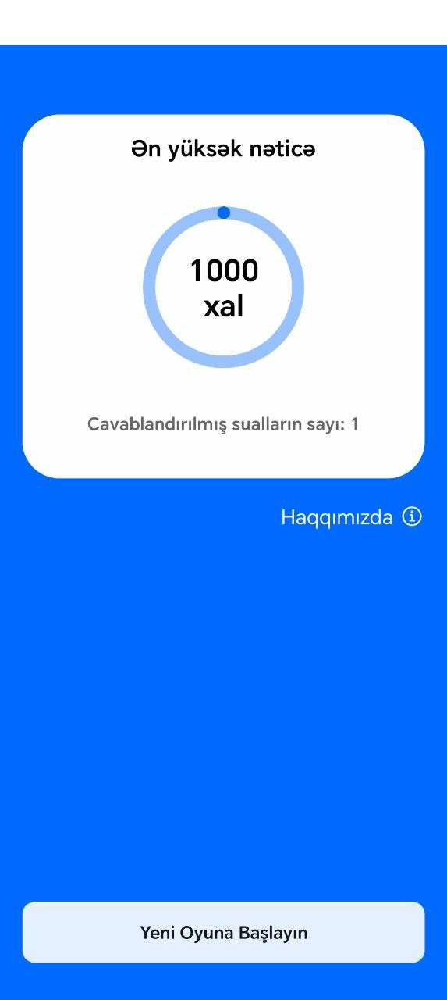

# Milyonçu 📱🎮

Bu layihə **Milyonçu** oyunudur, 6 ay əvvəl yaratmışdım. 🕰️

## Haqqında ✨

Milyonçu oyunu istifadəçilərə intellektual suallar vasitəsilə əyləncə təqdim edir. 📚🎉
Lakin artıq bu oyun Play Store-dan qaldırıldı(Developer accountuna görə) və indi **open source** olaraq sizə təqdim edirəm. 🌍🔓

## Necə işə salmalı? 🚀

Bu layihə **React Native**-də yazılmışdır. Onu işə salmaq üçün aşağıdakı addımları izləyin:

### Tələblər 📋

- **Node.js** (Son versiyanı yükləyin) 🌐
- **Expo CLI** (Global olaraq quraşdırılmış olmalıdır) 📱
- **Android Studio** (Emulator üçün, əgər fiziki cihaz istifadə etmirsinizsə) 🤖
- **iOS Simulator** (macOS istifadə edirsinizsə) 🍎

### Addımlar ⚙️

1. **Repository-ni klonlayın:**

   ```bash
   git clone https://github.com/abdullaabdullazade/MillionerAZ.git
   ```

2. **Layihə qovluğuna keçin:**

   ```bash
   cd MillionerAZ
   ```

3. **Asılılıqları quraşdırın:**

   ```bash
   npm install
   ```

4. **Expo server-i işə salın:**

   ```bash
   npx expo start
   ```

5. **Mobil cihazda və ya emulatorda çalışdırın:**
   - **Expo Go** tətbiqini mobil cihazınıza yükləyin və QR kodunu skan edin. 📲
   - **Android/iOS Emulator** istifadə edirsinizsə, Expo server üzərindən cihaz seçimi edin. 🤖🍎

### Screenshots

<p align="center">
  
  
  
  
  
  
  
  
  
</p>
https://github.com/user-attachments/assets/2c5c57ef-591c-4a86-be7b-2bc245e05f00

### Qeyd:

- Əgər Expo Go istifadə edirsinizsə, cihazınızın və kompüterinizin eyni Wi-Fi şəbəkəsində olduğundan əmin olun. 🌐

<h1>Bəyəndinizsə zəhmət olmasa star atın :)</h1>

## Əlaqə 📬

Hər hansı bir sualınız varsa, mənimlə GitHub vasitəsilə əlaqə saxlaya bilərsiniz. 😊

🔗 **Repository**: [Milyonçu GitHub Repository](https://github.com/abdullaabdullazade/MillionerAZ)
